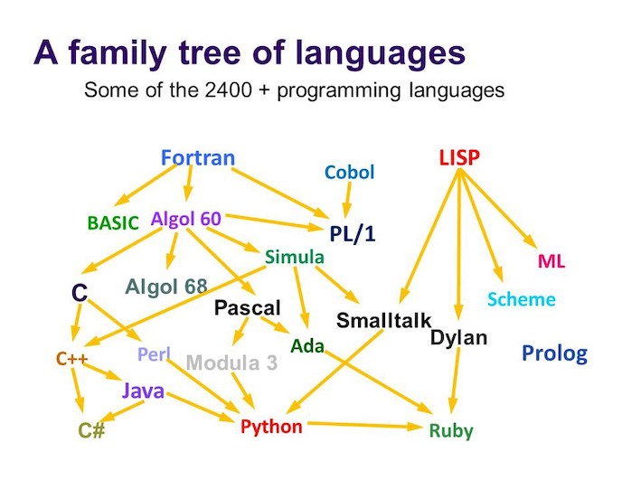

% EMAT10006 - FCP - Lecture 01
% Oscar Benjamin
% Week 13

The idea
--------

* Build on the intro unit
* Reinforce basic programming
* Think about larger codebases
* Work collaboratively
* Use version control (git/github)

Schedule
--------

* Runs from week 13 to week 23 (except week 18).
* 1hr lecture
* 2hr lab
* Dropin session
* Forum?
* Deadlines...

Assignments
-----------

| Assignment | Deadline | Group? | Weight |
|------|---------|-----------|----|
| 1 | Tuesday Wk 16 | Individual | 25% |
| 2 | Tuesday Wk 19 | Pairs      | 25% |
| 3 | Friday Wk 23 | Group of 4  | 50% |

Why Python?
-----------

* High level language
* Intends not to be hard to learn
* Suitable for scientific/engineering work
* Used heavily in data science etc
* Right tool for the job in student projects

How Python?
-----------

* Created by Guido van Rossum in the early 90s
* Derived from the C family
* Very popular after 30 years

Family tree
-----------

